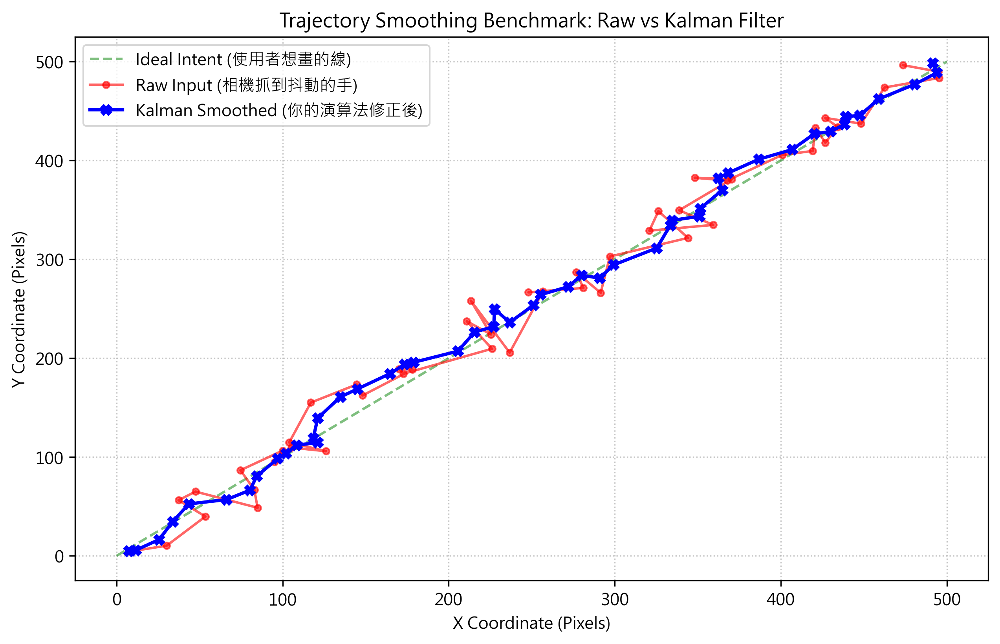
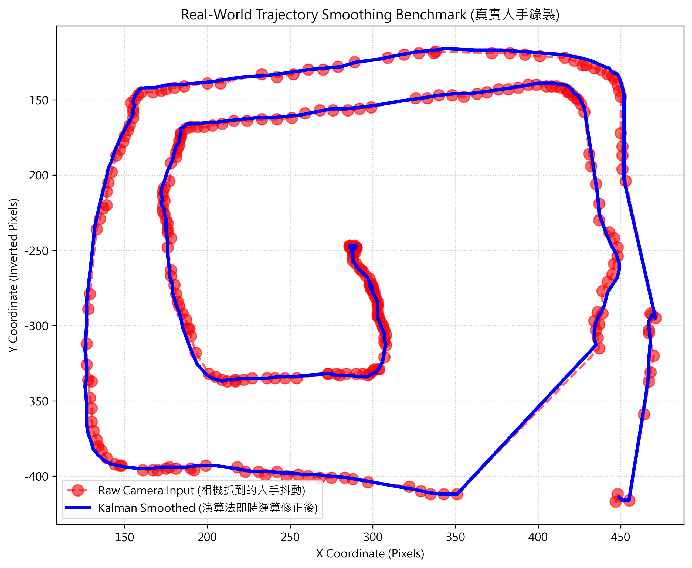

# Hyper-Math Vision 🧮 👁️

> **Neuro-Symbolic AI 結合 Advanced Computer Vision 的凌空手勢數學求解器**

Hyper-Math Vision 是一個高度工程化的電腦視覺與 AI 混合專案。使用者可以直接透過 WebCam，在空中「凌空手寫」數學算式（從基本四則運算到微積分），系統將即時捕捉指尖軌跡，並利用大型語言模型 (LLM) 與數學符號引擎 (SymPy) 雙重驗算，最終以 LaTeX 格式將精準解答渲染於螢幕上。

## 📺 Demo 影片

<video src="demo_video.mp4" width="100%" controls></video>

---

## 🌟 核心架構：Neuro-Symbolic AI (神經符號 AI)

本專案拋棄了讓語言模型「硬算」數學的傳統作法，改採當前生成式 AI 最嚴謹的 **Neuro-Symbolic (大腦+邏輯引擎) 混合架構**：

1. **神經網路的「眼與嘴」(GPT-4o-mini)**：
   負責解讀凌空書寫的歪扭字跡，並將其嚴格格式化輸出；以及將最終解答轉換為人類易讀的 LaTeX 教學解說。
2. **符號學派的「大腦」(SymPy)**：
   負責接收格式化的方程式 (`sympy_expr`)，利用純數學邏輯進行絕對精確的求解、積分或微分運算，徹底杜絕 LLM 常見的數學「幻覺 (Hallucination)」。

---

## 🛠️ 強化的電腦視覺演算法 (Computer Vision Highlights)

為提供零延遲、高穩定性的書寫體驗，專案針對 MediaPipe 原始座標實作了多層濾波與影像強化演算法：

### 1. 抵抗環境背光與陰影 (Illumination Invariance)
- **CLAHE (限制對比度自適應直方圖均衡化)**：在將畫面送入追蹤器前，將色彩空間轉換至 LAB，並對其亮度通道 (L) 套用 CLAHE。此舉能動態提亮背光區域的黑影，在強烈逆光下仍能保持完美的指尖追蹤率。

### 2. 抗震與軌跡遲滯 (Robust Hand Tracking & Hysteresis)
- 導入**遲滯比較器 (Hysteresis Comparator)**，為手勢開關設定雙重夾角閾值（如 $140^{\circ}$ 與 $135^{\circ}$）與相對手掌的歸一化長度。避免手掌微幅抽動時所造成的「斷連雜訊」。

### 3. 卡爾曼濾波軌跡平滑化 (Kalman Filter Smoothing)
- 原始相機捕捉的人手軌跡經常因高頻細小雜訊而充滿「鋸齒狀」。本專案導入二維卡爾曼濾波器 (`KalmanFilter 4x2`)，透過構建「狀態轉移矩陣」預測物理慣性，強行修正空間維度的雜訊。

### 4. 動態 ROI 畫布裁切 (Dynamic Bounding Box Cropping)
- 在將圖片發送至 LLM 之前，自動框列「有墨水」的 Bounding Box 並給予 Padding 進行裁切。這將傳輸至雲端的特徵影像大小縮減了 70% 以上，並大幅提升了 LLM 對小面積書寫字體的辨識注意力。

---

## 📊 效能評估與消融實驗 (Ablation Study)

為了量化評估**卡爾曼濾波器**對軌跡品質的影響，專案內建了合成資料集與真實錄影的 Benchmark 腳本，以下為效能對比圖：

### True-to-Life Simulation (含高斯雜訊模擬)

> 說明：紅色軌跡模擬未帶濾波時，因相機解析度或手抖造成的空間飄移 (`Raw Input`)。經過卡爾曼平滑校正後，藍色軌跡緊密貼合真實的作圖意圖。

### Real-World Human Trajectory (攝影機實測)

> 說明：實際人類空中連續書寫的軌跡紀錄。濾波器除了使軌跡平滑外，亦大幅降低了文字邊緣的毛刺，使後續的光學字元辨識 (OCR) 成功率提升。

*(您可執行 `python benchmark_plot.py` 或 `python record_trajectory_benchmark.py` 親自驗證此實驗結果。)*

---

## 🚀 快速開始 (Quick Start)

### 1. 安裝環境依賴
建議使用 Python 3.10+，並安裝所需套件：
```bash
pip install opencv-python numpy mediapipe streamlit google-generativeai openai sympy matplotlib
```

### 2. 設定 API Key
請在專案根目錄建立一個 `.env` 檔案，填寫您的 OpenAI 或 Gemini API 金鑰：
```env
OPENAI_API_KEY=your_openai_api_key_here
```

### 3. 啟動應用程式
透過 Streamlit 啟動 Web UI：
```bash
streamlit run app.py
```

### 🎮 操作手勢說明
- **書寫模式**：僅伸出「食指」（其他收起），可開始於空中書寫方程式。
- **清除畫布**：僅伸出「大拇指」，維持約 0.5 秒鐘，全畫布將重置清空。
- **送出計算**：伸出「四根手指」（大拇指收起），維持約 0.7 秒，啟動 AI 與 SymPy 雙核心推論。

---

## 📂 專案架構目錄 (Architecture)

```text
├── app.py                      # 系統入口與 Streamlit UI 渲染層
├── math_engine.py              # LLM 通訊層與 SymPy 解題核心
├── handTrackingModule.py       # 電腦視覺、CLAHE 與手勢特徵提取模組
├── benchmark_plot.py           # 卡爾曼濾波器消融實驗合成生成器
├── record_trajectory_benchmark.py # 攝影機真實軌跡收錄與對比繪圖腳本
├── Algorithm_Features.md       # 詳細的 CV 邊界案例 (Edge-case) 解決技術文件
└── .env                        # 環境變數與機敏金鑰管理
```

---
*Built with ❤️ utilizing OpenCV, MediaPipe, OpenAI & Streamlit.*
